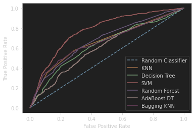
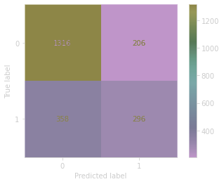

# Natural Language Processing with Disaster Tweets 

## The dataset
Twitter has become an important communication channel in times of emergency.
The ubiquitousness of smartphones enables people to announce an emergency they’re observing in real-time. Because of this, more agencies are interested in programatically monitoring Twitter (i.e. disaster relief organizations and news agencies).

But, it’s not always clear whether a person’s words are actually announcing a disaster. Take this example:


The author explicitly uses the word “ABLAZE” but means it metaphorically. This is clear to a human right away, especially with the visual aid. But it’s less clear to a machine.

The aim of this dataset is to build a machine learning model that predicts which Tweets are about real disasters and which one’s aren’t.

The source link of the dataset is [here](https://www.kaggle.com/c/nlp-getting-started)

### Dataset structure
The dataset is composed by 5 columns where's:
<ul>
<li><b>Id</b> - Identifier of the tweet</li>

<li><b>Keyword</b> - Keyword of tweet, most of them are empty</li>

<li><b>Location</b> - Location where the tweet were pubblished, most are also empty</li>

<li><b>Text</b> - Source text of the tweet</li>

<li><b>Target</b> - Label of the tweet, if is a disaster or not</li>

</ul>

## Methodology
### Data preprocessing
There was a cleaning in the text, removing specials character, punctuation, as others methods
and **tokenization**.

After this prepocessing, the data was transformed into a **TF-IDF** matrix and had your dimensionality reduced by a **PCA**.

### Training and test division
There were a stratified split, with a 80% of training and 20% of test.

### Classifiers
Here are the list of the classifiers applied into the dataset:
<ul>
<li>KNN</li>
<li>Decision Tree</li>
<li>SVM</li>
<li>Adaboost with DT</li>
<li>Bagging with KNN</li>
<li>Random Forest</li>
</ul>

By the ROC curve we can see that the SVM had the best result compare to the others classifiers.



#### SVM results report
```text
              precision    recall  f1-score   support

           0       0.79      0.86      0.82      1522
           1       0.59      0.45      0.51       654

    accuracy                           0.74      2176
   macro avg       0.69      0.66      0.67      2176
weighted avg       0.73      0.74      0.73      2176
```



## Conclusion
As you can see, even the best classifier hadn't got a recall up to 0.5 of the positive class,
therefore, on futures works, more sofisticated approuchs can be applied in the preprocessing data,
as in classification, like deep learning, models like BERT, and on.

